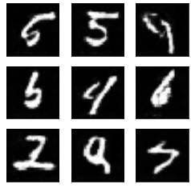

# KNN_Lernen

Dieses Projekt gibt eine kurze Einführung in das Thema "künstliche neuronale Netze" (Vorkenntnisse: Schulwissen).
Ein Kurzskript zum Thema befindet sich in "KNN.pdf". Im Ordner "Notebooks" befinden sich die zugehörigen Python-Notebooks: 

- KNN1.ipynb: siehe Abschnitt 3.2 im Skript.
- KNN2.ipynb: siehe Abschnitt 4.3 im Skript.
- KNN3.ipynb: Klassifikation, siehe Abschnitt 4 im Skript. Alternativ: https://playground.tensorflow.org.
- KNN4.ipynb: Bilderkennung (Ziffern auf 28 x 28-Pixel-Bildern, MNIST-Datensatz).
- KNN5.ipynb: GAN zum MNIST-Datensatz.
- KNN6.ipynb: Autoencoder

